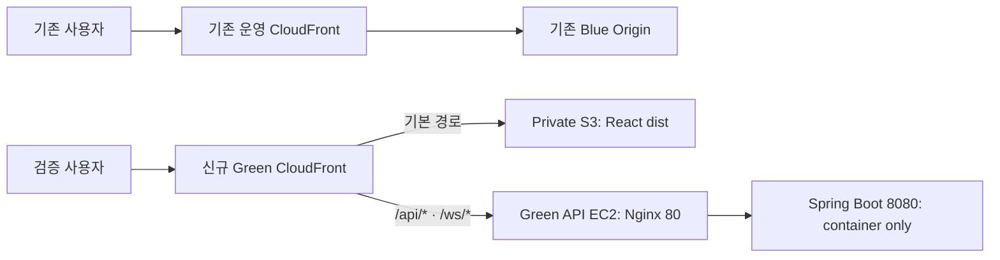

# AWS 인프라 분리 Phase 7 Private S3·독립 Green CloudFront 따라하기

이 문서는 Phase 6에서 검증한 Green API를 기존 사용자 트래픽과 분리한 상태로 유지하면서 React 정적 파일을 Private S3에 올리고 **두 번째 독립 CloudFront Distribution**에서 Web·API·WebSocket을 함께 검증하는 절차다.

이번 Phase의 핵심은 **기존 운영 CloudFront의 Origin과 behavior를 바꾸지 않는 것**이다. 신규 Green Distribution 검증이 실패해도 기존 Blue EC2와 현재 서비스는 계속 동작해야 한다. CloudFront Continuous Deployment, Staging Distribution, routing header, weight 전환은 사용하지 않는다.

기준 문서: [aws-infrastructure-separation-plan.md](aws-infrastructure-separation-plan.md)

2026-07-14 확정 결정: 상위 계획의 Phase 7 Staging/Continuous Deployment 절차 대신 이 문서의 **독립 Green Distribution 절차를 우선 적용**한다.

## 0. Phase 7 결과 구조



신규 Distribution에는 AWS가 새로운 `*.cloudfront.net` domain을 발급한다. 검증자는 이 신규 domain으로 직접 접속한다. 기존 domain `d1a7gxvxxd385i.cloudfront.net`은 계속 Blue를 사용한다.

## 1. 이번 Phase의 확정값

| 항목 | 값 |
| --- | --- |
| AWS 계정 ID | `443915990705` |
| Region | `ap-northeast-2` 서울 |
| 기존 운영 CloudFront domain | `d1a7gxvxxd385i.cloudfront.net` |
| 기존 운영 HTTPS origin | `https://d1a7gxvxxd385i.cloudfront.net` |
| 신규 Distribution 이름 | `buildgraph-demo-cloudfront-green` |
| 신규 Green CloudFront domain | 생성 후 기록 |
| Green EC2 | `buildgraph-demo-api-green-ec2` |
| Green Instance ID | `i-033105106a7970ac1` |
| Green Elastic IP | `43.203.33.190` |
| Green Public DNS | `ec2-43-203-33-190.ap-northeast-2.compute.amazonaws.com` |
| Green Nginx origin port | HTTP `80` |
| S3 bucket 후보 이름 | `buildgraph-demo-web-green-443915990705` |
| OAC 이름 | `buildgraph-demo-web-green-oac` |
| Web cache policy | `buildgraph-demo-web-static-cache` |
| SPA Function | `buildgraph-demo-web-spa-rewrite` |
| React API base | 빈 값, 즉 신규 CloudFront domain의 `/api/*` 사용 |

S3 bucket 이름은 전 세계에서 유일해야 한다. 후보 이름이 이미 사용 중이면 임의 이름으로 생성하지 말고 실제로 사용할 이름을 확정한 뒤 이 문서의 기록표에 적는다.

## 2. Phase 7 시작 전 하드 게이트

[aws-infrastructure-phase-6-console-guide.md](aws-infrastructure-phase-6-console-guide.md)의 28.2에 남은 확인을 먼저 끝낸다.

최소 통과 조건:

1. Green `/healthz`, `/api/health`가 계속 성공한다.
2. Green Compose에는 `nginx`, `api`, `xgb-reranker`만 있다.
3. `8080`, `8091`, `5432`, `6379`, `5671`이 host에 공개되지 않았다.
4. `.env.prod`가 `600 ubuntu:ubuntu`다.
5. Compose config SHA가 빈 입력 SHA가 아니다.
6. `nginx -t`가 성공한다.
7. IAM inline policy가 지정 Secret ARN 한 개만 읽는다.
8. Blue Compose와 Public IP `15.164.235.183`이 그대로다.
9. 기존 운영 CloudFront Origin과 behavior가 아직 Blue 그대로다.

하나라도 확인하지 못하면 S3 bucket과 OAC 준비까지만 할 수 있다. 신규 Green Distribution 생성 단계로 넘어가지 않는다.

## 3. 이번 Phase에서 하지 않는 작업

1. 기존 운영 Distribution의 기본 Origin을 S3로 바꾸지 않는다.
2. 기존 운영 Distribution의 `/api/*` 또는 `/ws/*`를 Green으로 바꾸지 않는다.
3. Blue EC2나 Blue Compose를 중지·재시작·수정하지 않는다.
4. Green Elastic IP를 Blue에 재연결하지 않는다.
5. S3 Static website hosting을 활성화하지 않는다.
6. S3 Public access 차단을 해제하지 않는다.
7. S3 object ACL을 public-read로 만들지 않는다.
8. Distribution 전체의 `403` 또는 `404`를 `index.html`로 바꾸지 않는다.
9. `/api/*`나 `/ws/*`에 정적 Web cache policy를 사용하지 않는다.
10. API origin에 HTTPS `443`을 설정하지 않는다. 이번 구조의 CloudFront → Green Nginx 구간은 HTTP `80`이다.
11. 실제 비밀번호·token·Secret value를 S3, CloudFront header, 문서, 스크린샷에 넣지 않는다.
12. Phase 8 전에는 GitHub Actions 자동 배포를 새 S3나 Green에 연결하지 않는다.
13. `Create staging distribution`, Continuous Deployment policy, routing header, weight-based 전환을 사용하지 않는다.

## 4. 기존 운영 CloudFront 현재 상태 기록

CloudFront 콘솔은 Global 서비스지만 AWS 콘솔의 로그인 계정이 `443915990705`인지 먼저 확인한다.

1. CloudFront 콘솔을 연다.
2. 왼쪽 메뉴에서 `Distributions`를 누른다.
3. domain이 `d1a7gxvxxd385i.cloudfront.net`인 기존 Distribution을 선택한다.
4. Distribution ID를 26번 기록표에 적는다.
5. `Origins` 탭에서 현재 Blue Origin의 다음 값을 기록한다.
   - Origin name
   - Origin domain
   - Origin protocol policy
   - HTTP port
6. `Behaviors` 탭을 열어 모든 path pattern과 Origin을 스크린샷으로 남긴다.
7. `Settings`에서 Supported HTTP versions를 확인한다.
8. 기존 Distribution의 Supported HTTP versions를 변경하지 않는다.
9. 기존 Distribution ID와 domain, Origin, behavior 기록을 26번 기록표에 남긴다.

## 5. React 정적 빌드 생성

이 작업은 로컬 Mac 또는 VS Code Dev Container 중 한 환경을 선택해 끝까지 같은 환경에서 수행한다. Dev Container를 사용 중이면 `/workspaces/prototype`, 로컬 Mac이면 `/Users/juhoseok/Desktop/prototype`이 저장소 root다. 두 환경이 공유하는 `node_modules`는 운영체제별 native package가 다를 수 있으므로 중간에 실행 환경을 바꾸지 않는다. EC2의 `.env.prod`나 Secrets Manager 값을 Web build에 복사하지 않는다. Vite 변수는 브라우저에 포함되므로 비밀값을 넣을 수 없다.

1. 배포할 commit을 확인한다.

```bash
# VS Code Dev Container
cd /workspaces/prototype

# 로컬 Mac에서 수행하는 경우에만 위 명령 대신 다음 경로를 사용한다.
# cd /Users/juhoseok/Desktop/prototype

git status --short
git rev-parse HEAD
```

2. 미커밋 변경이 있으면 어떤 commit을 배포할지 먼저 확정한다.
3. Web 의존성과 테스트를 실행한다.

```bash
cd apps/web
npm ci
npm run test -- --workers=1
```

VS Code Dev Container의 CPU·메모리가 제한된 상태에서 기본 병렬 worker를 사용하면 3D UI 테스트와 여러 Chromium이 동시에 실행되어 `Page crashed`, `Target crashed`, 연쇄 `page.goto` timeout이 발생할 수 있다. 배포 판정용 전체 테스트는 속도보다 재현성을 우선해 worker 한 개로 실행한다.

2026-07-14 실행 결과는 `252 passed`, `18 skipped`, `0 failed` 이므로 PASS다. 중간에 보인 `getaddrinfo ENOTFOUND api` 메시지는 Vite의 기본 API proxy 대상 `http://api:8080`을 독립 Dev Container에서 해석하지 못한 경고다. Playwright가 mock한 검증 요청은 모두 통과했으므로 Phase 7 테스트 실패로 판정하지 않는다.

4. 같은 domain의 `/api/*`를 사용하도록 `VITE_API_BASE_URL`을 빈 값으로 빌드한다.

```bash
VITE_API_BASE_URL= npm run build
```

5. 산출물을 확인한다.

```bash
# macOS에서 public 폴더에 생성된 배포 불필요 메타데이터를 제거한다.
find dist -type f -name '.DS_Store' -delete

test -f dist/index.html && echo 'PASS: dist/index.html'
find dist -maxdepth 2 -type f | sort
```

통과 기준:

- `npm run test -- --workers=1`이 PASS다.
- `npm run build`가 오류 없이 끝난다.
- `dist/index.html`이 있다.
- `dist/assets/`에 hash가 붙은 JavaScript·CSS 파일이 있다.
- `dist`에 `.DS_Store`가 남아 있지 않다.
- `dist` 안에 `.env.prod`, password, token 파일이 없다.

## 6. Private S3 bucket 생성

### 6.1 Create bucket

1. S3 콘솔을 연다.
2. Region이 서울인지 확인한다.
3. 왼쪽 메뉴에서 `General purpose buckets`를 누른다.
4. `Create bucket`을 누른다.
5. Bucket type은 `General purpose`를 선택한다.
6. Bucket name에 다음 후보를 입력한다.

```text
buildgraph-demo-web-green-443915990705
```

7. AWS Region은 `Asia Pacific (Seoul) ap-northeast-2`를 선택한다.
8. `Object Ownership`은 `ACLs disabled (recommended)`와 `Bucket owner enforced`를 유지한다.
9. `Block Public Access settings for this bucket`에서 `Block all public access`를 체크한다.
10. 네 개의 세부 Public access 차단 항목이 모두 체크됐는지 확인한다.
11. Bucket Versioning은 `Enable`로 설정한다. 잘못된 Web 업로드를 되돌릴 때 사용한다.
12. Default encryption은 `Server-side encryption with Amazon S3 managed keys (SSE-S3)`를 선택한다.
13. Bucket Key는 SSE-S3에서는 별도 설정하지 않는다.
14. 다음 tag를 추가한다.

| Key | Value |
| --- | --- |
| `Project` | `buildgraph-demo` |
| `Environment` | `green` |
| `Role` | `web` |

15. `Create bucket`을 누른다.
16. 생성된 실제 bucket 이름을 26번 기록표에 적는다.

### 6.2 Public 설정 확인

1. 생성한 bucket을 연다.
2. `Permissions` 탭을 연다.
3. `Block public access`가 `On`인지 확인한다.
4. `Object Ownership`이 `Bucket owner enforced`인지 확인한다.
5. `Access control list (ACL)`에 `Everyone (public access)` 권한이 없는지 확인한다.
6. `Properties` 탭의 `Static website hosting`이 `Disabled`인지 확인한다.

## 7. React dist 업로드

Vite hash asset과 `index.html`은 cache 정책이 다르므로 나눠서 업로드한다.

### 7.1 hash asset 업로드

1. S3 bucket의 `Objects` 탭을 연다.
2. `Upload`를 누른다.
3. 로컬 `apps/web/dist/assets` 폴더를 폴더째 추가한다.
4. S3 key가 `assets/<파일명>` 형태가 되는지 확인한다.
5. `Permissions`에서 public 권한을 추가하지 않는다.
6. `Properties` 또는 `Metadata`에서 system-defined metadata를 추가할 수 있으면 다음 값을 지정한다.

```text
Cache-Control: public,max-age=31536000,immutable
```

7. 업로드한다.

### 7.2 index와 root asset 업로드

1. 다시 `Upload`를 누른다.
2. `apps/web/dist/index.html`만 먼저 선택한다.
3. metadata에 다음 값을 설정한다.

```text
Cache-Control: no-cache,max-age=0,must-revalidate
```

4. `index.html`을 업로드한다.
5. `favicon.svg`처럼 `dist` root에 있는 나머지 public asset을 별도로 업로드한다.
6. root asset에는 다음 값을 사용할 수 있다.

```text
Cache-Control: public,max-age=3600
```

7. `Objects` 목록에서 `index.html`, `assets/`, root public asset이 보이는지 확인한다.
8. object의 `Permissions`에 public ACL이 없는지 다시 확인한다.

## 8. CloudFront Origin Access Control 생성

1. CloudFront 콘솔을 연다.
2. 왼쪽 메뉴에서 `Origin access` 또는 `Origin access control`을 연다.
3. `Create control setting`을 누른다.
4. Name에 다음을 입력한다.

```text
buildgraph-demo-web-green-oac
```

5. Origin type은 `S3`를 선택한다.
6. Signing behavior는 `Sign requests (recommended)` 또는 `Always`를 선택한다.
7. Signing protocol은 `SigV4`를 유지한다.
8. Description에 다음을 입력한다.

```text
OAC for BuildGraph Green private web bucket
```

9. 생성하고 OAC ID를 26번 기록표에 적는다.

S3 website endpoint를 Origin으로 쓰면 OAC를 사용할 수 없다. 반드시 일반 S3 bucket origin을 사용한다.

## 9. Web 정적 cache policy 생성

`index.html`의 `no-cache`와 hash asset의 1년 cache를 같은 S3 Origin metadata로 제어하려면 CloudFront 최소 TTL이 `0`인 정적 전용 policy를 사용한다.

1. CloudFront 콘솔 왼쪽 메뉴에서 `Policies` → `Cache`를 연다.
2. `Create cache policy`를 누른다.
3. Name에 다음을 입력한다.

```text
buildgraph-demo-web-static-cache
```

4. Description에 다음을 입력한다.

```text
Honor S3 Cache-Control for BuildGraph static assets and index.html
```

5. TTL settings를 다음처럼 설정한다.

| 항목 | 값 |
| --- | --- |
| Minimum TTL | `0` |
| Default TTL | `86400` |
| Maximum TTL | `31536000` |

6. Cache key settings는 다음처럼 둔다.
   - Headers: `None`
   - Cookies: `None`
   - Query strings: `None`
7. Compression support에서 `Gzip`과 `Brotli`를 활성화한다.
8. 생성하고 Cache policy ID를 26번 기록표에 적는다.

이 policy는 S3 기본 behavior에만 사용한다. `/api/*`와 `/ws/*`에는 사용하지 않는다.

## 10. 독립 Green CloudFront Distribution 생성

현재 열려 있는 `Create staging distribution` wizard가 있으면 `Cancel`을 누른다. 기존 운영 Distribution을 선택한 상태에서 `Edit`, `Create staging distribution`, `Continuous deployment`를 누르지 않는다.

### 10.1 Create distribution 시작

1. CloudFront 콘솔 왼쪽 메뉴에서 `Distributions`를 연다.
2. 목록에서 기존 domain `d1a7gxvxxd385i.cloudfront.net`이 `Enabled`인지 확인한다.
3. 기존 Distribution을 선택하지 않은 목록 화면에서 `Create distribution`을 누른다.
   - 기존 Free plan이 `Cancelling subscription` 상태이면 Pay-as-you-go 전환이 끝나고 버튼을 사용할 수 있을 때까지 기다린다.
   - 이 과정에서 기존 Distribution을 Disable 또는 Delete하지 않는다.
4. Architecture 또는 Distribution type 선택 화면이 나오면 `Standard distribution` 또는 단일 Web application용 표준 구성을 선택한다.
5. `Multi-tenant distribution`을 선택하지 않는다.
6. Distribution name에 다음을 입력한다.

```text
buildgraph-demo-cloudfront-green
```

7. Description 입력란이 있으면 다음을 입력한다.

```text
BuildGraph Green Web and API validation distribution
```

8. Alternate domain name은 비워 둔다. 이번 Phase에서는 AWS가 발급하는 새 `*.cloudfront.net` domain으로 검증한다.
9. Custom SSL certificate를 선택하지 않는다. 기본 CloudFront certificate를 사용한다.
10. Standard logging은 `Off`로 둔다.
11. WAF 또는 Security protections가 선택 사항으로 나오면 이번 검증 단계에서는 Web ACL을 연결하지 않는다.

### 10.2 기본 S3 Origin 설정

1. Origin type은 `Amazon S3`를 선택한다.
2. Origin domain에서 다음 bucket을 선택한다.

```text
buildgraph-demo-web-green-443915990705
```

3. `.s3-website-...` endpoint를 선택하거나 직접 입력하지 않는다.
4. Origin path는 비워 둔다.
5. Origin name은 다음 값으로 설정한다.

```text
buildgraph-demo-web-green-s3-origin
```

6. Origin access는 `Origin access control settings (recommended)`를 선택한다.
7. 기존 OAC `buildgraph-demo-web-green-oac`를 선택한다.
8. Signing behavior가 표시되면 `Sign requests (recommended)` 또는 `Always`인지 확인한다.
9. Custom header는 추가하지 않는다.
10. Origin Shield는 `No`로 유지한다.

### 10.3 기본 behavior와 Distribution 설정

1. Viewer protocol policy는 `Redirect HTTP to HTTPS`를 선택한다.
2. Allowed HTTP methods는 `GET, HEAD`를 선택한다.
3. Restrict viewer access는 `No`를 유지한다.
4. Cache policy는 `buildgraph-demo-web-static-cache`를 선택한다.
5. Origin request policy는 `None`을 선택한다.
6. Response headers policy는 `None`을 유지한다.
7. Compress objects automatically는 `Yes`로 설정한다.
8. Default root object 입력란이 보이면 다음을 입력한다.

```text
index.html
```

입력란이 생성 wizard에 보이지 않으면 Distribution 생성 후 `General` → `Settings` → `Edit`에서 `index.html`로 설정한다.

9. IPv6는 `Enable`을 유지한다.
10. Supported HTTP versions는 기본 권장값을 유지한다.
11. 다음 tag를 추가할 수 있으면 추가한다.

| Key | Value |
| --- | --- |
| `Name` | `buildgraph-demo-cloudfront-green` |
| `Project` | `buildgraph-demo` |
| `Environment` | `green` |
| `Role` | `web-api-edge` |

12. Review에서 기존 Blue EC2가 Origin으로 들어가 있지 않은지 확인한다.
13. `Create distribution`을 누른다.
14. 생성된 다음 값을 26번 기록표에 적는다.
    - Green Distribution ID
    - Green Distribution ARN
    - Green CloudFront domain
15. Status가 `Enabled`, 배포 상태가 `Deployed`가 될 때까지 기다린다.

이 시점에는 S3 Bucket policy가 아직 신규 Distribution을 허용하지 않아 새 domain에서 `403`이 나올 수 있다. 다음 단계에서 정확한 Distribution ID를 사용해 권한을 연다.

## 11. S3 Bucket policy에 Green Distribution 읽기 권한 추가

1. 신규 Green Distribution ID를 다시 확인한다.
2. S3 콘솔에서 Web bucket을 연다.
3. `Permissions` → `Bucket policy` → `Edit`를 누른다.
4. 아래 JSON에서 `<BUCKET_NAME>`과 `<GREEN_DISTRIBUTION_ID>`만 실제 값으로 바꾼다.

```json
{
  "Version": "2012-10-17",
  "Statement": [
    {
      "Sid": "AllowCloudFrontGreenReadOnly",
      "Effect": "Allow",
      "Principal": {
        "Service": "cloudfront.amazonaws.com"
      },
      "Action": "s3:GetObject",
      "Resource": "arn:aws:s3:::<BUCKET_NAME>/*",
      "Condition": {
        "StringEquals": {
          "AWS:SourceArn": "arn:aws:cloudfront::443915990705:distribution/<GREEN_DISTRIBUTION_ID>"
        }
      }
    }
  ]
}
```

5. 저장한다.
6. policy에 `Principal: "*"`, `s3:*`, `s3:PutObject`, `s3:ListBucket`이 없는지 확인한다.
7. Public access block은 계속 `On`으로 유지한다.

Phase 7에서는 신규 Green Distribution만 허용한다. 기존 운영 Distribution ARN을 이 policy에 추가하지 않는다.

## 12. Green API Origin 추가

1. 신규 Green Distribution의 `Origins` 탭을 연다.
2. `Create origin`을 누른다.
3. Origin domain에 Green Public DNS를 입력한다.

```text
ec2-43-203-33-190.ap-northeast-2.compute.amazonaws.com
```

4. 숫자 Elastic IP만 Origin domain에 입력하지 않는다.
5. Origin name에 다음을 입력한다.

```text
buildgraph-demo-api-green-origin
```

6. Origin protocol은 `HTTP only`를 선택한다.
7. HTTP port는 `80`을 입력한다.
8. HTTPS port는 사용하지 않는다.
9. Minimum origin SSL protocol은 HTTP-only Origin에서는 적용되지 않는다.
10. Origin response timeout은 `120 seconds`로 설정한다.
11. Origin keep-alive timeout은 기본값을 유지한다.
12. Custom header는 추가하지 않는다.
13. Origin Shield는 `No`로 유지한다.
14. Origin을 생성한다.

Green Nginx의 `/`는 의도적으로 `404`다. Web 화면은 Green EC2가 아니라 S3에서 제공된다.

## 13. Green Distribution cache behavior 구성

### 13.1 기본 `*` behavior 확인

1. 신규 Green Distribution의 `Behaviors` 탭을 연다.
2. `Default (*)` behavior를 선택하고 `Edit`을 누른다.
3. Origin은 `buildgraph-demo-web-green-s3-origin`을 선택한다.
4. Viewer protocol policy는 `Redirect HTTP to HTTPS`를 선택한다.
5. Allowed HTTP methods는 `GET, HEAD`를 선택한다.
6. Restrict viewer access는 `No`를 유지한다.
7. Cache policy는 `buildgraph-demo-web-static-cache`를 선택한다.
8. Origin request policy는 `None`을 선택한다.
9. Response headers policy는 현재 단계에서는 `None`을 유지한다.
10. Compress objects automatically는 `Yes`로 설정한다.
11. 저장한다.

### 13.2 `/api/*` behavior 생성

1. `Create behavior`를 누른다.
2. Path pattern에 다음을 입력한다.

```text
/api/*
```

3. Origin은 `buildgraph-demo-api-green-origin`을 선택한다.
4. Viewer protocol policy는 `Redirect HTTP to HTTPS`를 선택한다.
5. Allowed HTTP methods는 다음 전체 method를 선택한다.

```text
GET, HEAD, OPTIONS, PUT, POST, PATCH, DELETE
```

6. Cache policy는 AWS managed `CachingDisabled`를 선택한다.
7. Origin request policy는 AWS managed `AllViewer`를 선택한다.
8. Response headers policy는 `None`을 유지한다. Spring API의 CORS 응답을 사용한다.
9. Compress objects automatically는 `Yes`로 설정한다.
10. 저장한다.

`AllViewer`를 사용해야 `Authorization`, `Origin`, Cookies, query string과 API에 필요한 viewer header가 Green으로 전달된다.

### 13.3 `/ws/*` behavior 생성

1. `Create behavior`를 누른다.
2. Path pattern에 다음을 입력한다.

```text
/ws/*
```

3. Origin은 `buildgraph-demo-api-green-origin`을 선택한다.
4. Viewer protocol policy는 `Redirect HTTP to HTTPS`를 선택한다.
5. Allowed HTTP methods는 `GET, HEAD, OPTIONS`를 선택한다.
6. Cache policy는 AWS managed `CachingDisabled`를 선택한다.
7. Origin request policy는 AWS managed `AllViewer`를 선택한다.
8. Response headers policy는 `None`을 유지한다.
9. 저장한다.

`AllViewer`는 WebSocket handshake의 `Sec-WebSocket-*`, `Upgrade`, `Connection`, Cookies와 query string을 Origin으로 전달한다.

### 13.4 최종 Origin·behavior 확인

1. behavior 표가 다음과 같은지 확인한다.

| 우선순위 | Path | Origin | Cache |
| --- | --- | --- | --- |
| 상위 | `/api/*` | Green API | `CachingDisabled` |
| 상위 | `/ws/*` | Green API | `CachingDisabled` |
| 마지막 | `Default (*)` | Private S3 | Web static policy |

2. Origins에는 Private S3와 Green API 두 개만 있어야 한다.
3. 기존 Blue EC2 `15.164.235.183` 또는 그 Public DNS가 신규 Distribution에 없음을 확인한다.
4. 기존 운영 Distribution의 Blue Origin은 삭제하거나 수정하지 않는다.

## 14. 신규 domain을 Green API 환경에 반영

신규 CloudFront domain은 Distribution 생성 후에만 알 수 있다. Green API가 신규 브라우저 Origin의 REST CORS와 WebSocket handshake를 허용하도록 Green Secret을 수정한다. 기존 Blue `.env.prod`는 수정하지 않는다.

### 14.1 Secrets Manager 값 수정

1. Secrets Manager 콘솔에서 `buildgraph/demo-green/api-env`를 연다.
2. `Retrieve secret value` 후 `Edit`을 누른다.
3. `<GREEN_CF_DOMAIN>`을 실제 신규 domain으로 바꿔 다음 세 값을 수정한다.

```dotenv
BUILDGRAPH_CORS_ALLOWED_ORIGINS=https://<GREEN_CF_DOMAIN>
GOOGLE_OAUTH_REDIRECT_URI=https://<GREEN_CF_DOMAIN>/api/auth/google/callback
GOOGLE_OAUTH_WEB_CALLBACK_URL=https://<GREEN_CF_DOMAIN>/auth/callback
```

4. `https://`를 포함하고 끝에 `/`를 붙이지 않는다.
5. 다른 endpoint, password, token 값을 바꾸지 않는다.
6. 저장한다.

### 14.2 Green EC2에 Secret 재적용

Green EC2의 SSM 또는 SSH terminal에서 실행한다. Secret 원문을 화면에 출력하지 않는다.

```bash
cd /opt/buildgraph/prototype
umask 077

aws secretsmanager get-secret-value \
  --secret-id buildgraph/demo-green/api-env \
  --region ap-northeast-2 \
  --query SecretString \
  --output text \
  --no-cli-pager > .env.prod

chmod 600 .env.prod
stat -c '%a %U:%G %n' .env.prod

docker compose -p buildgraph-green \
  -f compose.api.prod.yaml \
  --env-file .env.prod \
  up -d --no-deps --force-recreate api
```

`600 ubuntu:ubuntu .env.prod`인지 확인한다. API 재시작 직후 Nginx가 잠깐 `502`를 반환할 수 있으므로 health가 돌아올 때까지 확인한다.

```bash
for attempt in $(seq 1 30); do
  if curl -fsS http://127.0.0.1/api/health; then
    echo
    break
  fi
  sleep 2
done
```

### 14.3 Google OAuth 승인 URI 추가

Google Cloud Console의 기존 OAuth Client에 신규 redirect URI와 JavaScript origin을 **추가**한다. 기존 Blue URI는 삭제하지 않는다.

- Authorized redirect URI: `https://<GREEN_CF_DOMAIN>/api/auth/google/callback`
- Authorized JavaScript origin: `https://<GREEN_CF_DOMAIN>`

`https://<GREEN_CF_DOMAIN>/auth/callback`은 Green Secret의 Web callback 값이며 Google Console의 redirect URI 입력란에는 추가하지 않는다.

## 15. SPA route용 CloudFront Function 생성

Distribution 전체의 custom error response를 사용하면 API `404`까지 React `index.html`로 바뀔 수 있다. 확장자 없는 Web route만 `/index.html`로 rewrite하는 Function을 기본 S3 behavior의 Viewer request에만 연결한다.

1. CloudFront 콘솔 왼쪽 메뉴에서 `Functions`를 연다.
2. `Create function`을 누른다.
3. Name에 다음을 입력한다.

```text
buildgraph-demo-web-spa-rewrite
```

4. Runtime은 최신 CloudFront Functions JavaScript runtime을 선택한다.
5. 아래 코드를 입력한다.

```javascript
async function handler(event) {
  const request = event.request;
  const uri = request.uri;

  if (uri.startsWith('/api/') || uri.startsWith('/ws/')) {
    return request;
  }

  const lastSegment = uri.split('/').pop() || '';
  if (uri.endsWith('/') || !lastSegment.includes('.')) {
    request.uri = '/index.html';
  }

  return request;
}
```

6. 저장한다.
7. Test 탭에서 URI `/parts`를 넣어 결과 URI가 `/index.html`인지 확인한다.
8. URI `/assets/example.js`는 바뀌지 않는지 확인한다.
9. `Publish`를 누른다.
10. 신규 Green Distribution의 `Behaviors` 탭으로 돌아간다.
11. `Default (*)` behavior만 편집한다.
12. Function associations의 `Viewer request`에 `buildgraph-demo-web-spa-rewrite`를 연결한다.
13. `/api/*`, `/ws/*` behavior에는 이 Function을 연결하지 않는다.
14. 저장하고 신규 Distribution 상태가 `Deployed`가 될 때까지 기다린다.

## 16. Private S3 차단 검증

로컬 Mac 터미널에서 `<BUCKET_NAME>`을 실제 bucket 이름으로 바꾼다.

```bash
curl -I "https://<BUCKET_NAME>.s3.ap-northeast-2.amazonaws.com/index.html"
```

통과 기준:

- `403 Forbidden`이 반환된다.
- S3 object가 직접 공개되지 않는다.
- 잠깐이라도 Public access block을 해제해 확인하지 않는다.

## 17. 신규 Green CloudFront Web·API 검증

CloudFront deployment가 완료된 뒤 로컬 Mac 터미널에서 실행한다. `<GREEN_CF_DOMAIN>`을 실제 신규 domain으로 바꾼다.

```bash
export CF_DOMAIN="<GREEN_CF_DOMAIN>"
```

### 17.1 React root와 SPA route

```bash
curl -sS -D - -o /dev/null "https://$CF_DOMAIN/"
curl -sS -D - -o /dev/null "https://$CF_DOMAIN/parts"
```

두 요청 모두 `200`이어야 한다. `/parts`가 `403` 또는 `404`면 SPA Function association을 다시 확인한다.

### 17.2 Green API health

```bash
export PHASE7_PROBE="phase7-green-cf-$(date +%s)"

curl -sS -D /tmp/phase7-api-headers.txt \
  -o /tmp/phase7-api-health.json \
  -H "User-Agent: $PHASE7_PROBE" \
  "https://$CF_DOMAIN/api/health?probe=$PHASE7_PROBE"

cat /tmp/phase7-api-headers.txt
jq . /tmp/phase7-api-health.json
```

통과 기준:

- HTTP `200`이다.
- body가 `{"database":"UP","status":"UP"}` 의미와 일치한다.
- CloudWatch Green Nginx log에서 `$PHASE7_PROBE`가 보인다.
- 이 고유 probe가 Green log에 보이면 신규 CloudFront → Green으로 전달된 것이다.

`/healthz`는 `/api/*` behavior에 해당하지 않으므로 CloudFront 검증에 사용하지 않는다. `/api/health`를 사용한다.

### 17.3 API cache 비활성 검증

```bash
for attempt in 1 2; do
  curl -sS -D - -o /dev/null \
    "https://$CF_DOMAIN/api/health?attempt=$attempt"
done
```

확인 기준:

- API 응답에 오래 유지되는 `Age`가 없어야 한다.
- `x-cache`가 반복 요청을 정적 object처럼 장기 cache hit로 처리하면 안 된다.
- `/api/*` behavior의 Cache policy가 `CachingDisabled`인지 다시 확인한다.

### 17.4 API 404가 SPA로 가려지지 않는지 확인

```bash
curl -sS -D - "https://$CF_DOMAIN/api/phase7-not-found"
```

통과 기준:

- React `index.html`과 HTTP `200`이 나오면 실패다.
- API가 정의한 `404` JSON 응답이 나와야 한다.

## 18. 신규 domain 인증·부품 API 스모크

로컬 Mac 터미널에서 임시 결과 디렉터리를 만든다.

```bash
umask 077
export PHASE7_SMOKE_DIR="$(mktemp -d)"
```

1. 로그인한다.

```bash
curl -fsS \
  -X POST "https://$CF_DOMAIN/api/auth/login" \
  -H 'Content-Type: application/json' \
  --data '{"email":"user@example.com","password":"passw0rd!"}' \
  > "$PHASE7_SMOKE_DIR/login.json"

export ACCESS_TOKEN="$(jq -er '.accessToken' "$PHASE7_SMOKE_DIR/login.json")"
export REFRESH_TOKEN="$(jq -er '.refreshToken' "$PHASE7_SMOKE_DIR/login.json")"
echo 'PASS: Green CloudFront login'
```

2. 부품 목록을 조회한다.

```bash
curl -fsS \
  "https://$CF_DOMAIN/api/parts?page=0&size=3" \
  -H "Authorization: Bearer $ACCESS_TOKEN" \
  > "$PHASE7_SMOKE_DIR/parts.json"

jq -e '(.items | length) > 0' "$PHASE7_SMOKE_DIR/parts.json" >/dev/null &&
echo 'PASS: Green CloudFront parts'
```

3. token refresh를 확인한다.

```bash
jq -nc --arg refreshToken "$REFRESH_TOKEN" \
  '{refreshToken:$refreshToken}' \
  > "$PHASE7_SMOKE_DIR/refresh-request.json"

curl -fsS \
  -X POST "https://$CF_DOMAIN/api/auth/refresh" \
  -H 'Content-Type: application/json' \
  --data-binary @"$PHASE7_SMOKE_DIR/refresh-request.json" \
  > "$PHASE7_SMOKE_DIR/refresh.json"

export ACCESS_TOKEN="$(jq -er '.accessToken' "$PHASE7_SMOKE_DIR/refresh.json")"
export REFRESH_TOKEN="$(jq -er '.refreshToken' "$PHASE7_SMOKE_DIR/refresh.json")"
echo 'PASS: Green CloudFront token refresh'
```

4. Phase 6의 RAG·Build Chat·Agent 전체 스모크를 다시 실행할 때는 `BASE_URL`을 아래처럼 둔다.

```bash
export BASE_URL="https://$CF_DOMAIN"
```

CloudFront routing 확인 목적이므로 Phase 6에서 이미 성공한 관리형 인프라 단위 테스트를 다시 실행할 필요는 없다. 다만 다음 실제 API는 한 번씩 확인한다.

- RAG vector 검색
- Build Chat 응답
- Agent session `SUCCEEDED`
- Redis cache hit
- RabbitMQ worker 처리

5. 최종 logout은 다른 검증을 끝낸 뒤 실행한다.

```bash
jq -nc --arg refreshToken "$REFRESH_TOKEN" \
  '{refreshToken:$refreshToken}' \
  > "$PHASE7_SMOKE_DIR/logout-request.json"

curl -fsS \
  -X POST "https://$CF_DOMAIN/api/auth/logout" \
  -H "Authorization: Bearer $ACCESS_TOKEN" \
  -H 'Content-Type: application/json' \
  --data-binary @"$PHASE7_SMOKE_DIR/logout-request.json"

echo 'PASS: Green CloudFront logout'
```

## 19. 신규 domain WebSocket 검증

WebSocket은 HTTP/1.1 upgrade로 동작한다. `/ws/*`가 S3로 가지 않고 Green Nginx로 전달되는지 확인한다.

1. 관리자 계정으로 로그인하고 queue ticket을 발급한다.

```bash
curl -fsS \
  -X POST "https://$CF_DOMAIN/api/auth/login" \
  -H 'Content-Type: application/json' \
  --data '{"email":"admin@example.com","password":"passw0rd!"}' \
  > "$PHASE7_SMOKE_DIR/admin-login.json"

export ADMIN_ACCESS_TOKEN="$(jq -er '.accessToken' "$PHASE7_SMOKE_DIR/admin-login.json")"

curl -fsS \
  -X POST "https://$CF_DOMAIN/api/admin/support/chat-sessions/ws-ticket" \
  -H "Authorization: Bearer $ADMIN_ACCESS_TOKEN" \
  > "$PHASE7_SMOKE_DIR/ws-ticket.json"

jq . "$PHASE7_SMOKE_DIR/ws-ticket.json"
```

2. `ticket` 값을 화면에 공개하지 말고 본인 터미널에서만 사용한다.
3. 로컬에 `wscat`이 있으면 다음처럼 접속한다.

```bash
npx wscat -c "wss://$CF_DOMAIN/ws/admin/support-chat-queue"
```

4. 연결 후 5초 안에 아래 JSON의 `<TICKET>`을 실제 일회용 ticket으로 바꿔 입력한다.

```json
{"type":"AUTH","ticket":"<TICKET>"}
```

통과 기준:

- handshake가 `101 Switching Protocols`로 연결된다.
- `SUPPORT_CHAT_QUEUE_READY` 계열 메시지를 받는다.
- `403`, `502`, timeout이면 `/ws/*` behavior와 `AllViewer`, Green Nginx upgrade 설정을 확인한다.

## 20. 브라우저·Google OAuth 검증

신규 Distribution은 기존 사용자 요청을 받지 않으므로 weight 전환이나 routing header가 필요 없다.

1. 신규 domain이 `Deployed`인지 확인한다.
2. 14번의 Green Secret과 Google OAuth 승인 URI 반영을 완료한다.
3. 새 시크릿 브라우저 창에서 다음 주소를 연다.

```text
https://<GREEN_CF_DOMAIN>
```

4. 같은 창을 유지하며 다음을 검증한다.
   - React 첫 화면
   - `/parts` 직접 접속과 새로고침
   - 사용자 로그인
   - 부품 목록·견적 저장·조회
   - Build Chat
   - WebSocket 상담 연결
   - Google OAuth 로그인과 `/api/auth/google/callback`
5. 브라우저 개발자 도구의 Network에서 API 요청이 같은 신규 domain의 `/api/*`로 가는지 확인한다.
6. Green CloudWatch Nginx log에서 브라우저 요청이 보이는지 확인한다.
7. 기존 운영 domain을 새로고침해 Blue 서비스가 계속 정상인지 별도로 확인한다.

## 21. 기존 운영 CloudFront·Blue 무변경 최종 확인

1. 기존 운영 CloudFront의 `Origins`를 연다.
2. 4번에서 기록한 Blue Origin domain과 비교한다.
3. 기존 운영 기본 behavior와 기존 behavior가 4번 기록과 같은지 확인한다.
4. 기존 운영 Distribution이 Green Public DNS나 새 S3 bucket을 Origin으로 사용하지 않는지 확인한다.
5. 기존 운영 Distribution에 Continuous Deployment policy가 새로 연결되지 않았는지 확인한다.
6. 신규 Green Distribution ID와 기존 운영 Distribution ID가 서로 다른지 확인한다.
7. Blue EC2 Public IP가 `15.164.235.183`인지 확인한다.
8. Blue에서 조회 명령만 실행한다.

```bash
docker compose -f compose.prod.yaml --env-file .env.prod ps
```

9. 기존 서비스가 계속 실행 중인지 확인한다.
10. 기존 운영 CloudFront 요청이 계속 성공하는지 확인한다.

```bash
curl -I "https://d1a7gxvxxd385i.cloudfront.net/"
curl -sS "https://d1a7gxvxxd385i.cloudfront.net/api/health" | jq .
```

## 22. Phase 7 완료 조건

- [ ] Phase 6의 남은 보류 항목을 모두 확인함
- [ ] 배포할 Web Git SHA 기록
- [x] `npm run test -- --workers=1` PASS (`252 passed`, `18 skipped`, `0 failed`)
- [x] `npm run build` PASS와 `dist/index.html` 확인 (`1882 modules transformed`, Vite build 성공)
- [ ] Private S3 bucket 생성
- [ ] S3 Block Public Access 네 항목 모두 활성
- [ ] S3 Object Ownership이 Bucket owner enforced
- [ ] S3 Static website hosting 비활성
- [ ] hash asset Cache-Control이 1년 immutable
- [ ] `index.html` Cache-Control이 no-cache
- [ ] OAC 생성과 request signing 활성
- [ ] 신규 Green Distribution 생성 및 `Deployed`
- [ ] 신규 Green Distribution ID·ARN·domain 기록
- [ ] Bucket policy가 신규 Green Distribution의 `s3:GetObject`만 허용
- [ ] S3 직접 object 요청이 `403`
- [ ] 신규 기본 behavior가 Private S3 사용
- [ ] 신규 `/api/*`가 Green Nginx 사용
- [ ] 신규 `/ws/*`가 Green Nginx 사용
- [ ] `/api/*` Cache policy가 `CachingDisabled`
- [ ] `/api/*` Allowed methods가 전체 API method 포함
- [ ] `/api/*` Origin request policy가 `AllViewer`
- [ ] `/ws/*` Cache policy가 `CachingDisabled`
- [ ] `/ws/*` Origin request policy가 `AllViewer`
- [ ] SPA Function이 Default behavior의 Viewer request에만 연결
- [ ] Green Secret의 CORS·OAuth URL을 신규 domain으로 변경
- [ ] Google OAuth 승인 URI에 신규 domain 추가
- [ ] Green API container 재생성 후 health 복구
- [ ] 신규 domain root와 SPA route가 `200`
- [ ] 신규 domain `/api/health`가 `200`이며 Green log에서 probe 확인
- [ ] API `404`가 React `index.html`로 바뀌지 않음
- [ ] 로그인·refresh·logout PASS
- [ ] 부품·견적·Build Chat·RAG·Agent PASS
- [ ] WebSocket `101`과 ticket 인증 PASS
- [ ] Google OAuth callback PASS
- [ ] 기존 운영 Origin과 behavior가 Blue 그대로
- [ ] 기존 운영 Distribution에 Continuous Deployment policy 없음
- [ ] Blue EC2·Compose·Public IP 무변경

모든 항목이 통과하면 Phase 7을 완료한다. 기존 운영 domain은 여전히 Blue를 사용하므로 일반 사용자 전환은 완료된 것이 아니다. Phase 8에서 Web/API CI/CD를 분리한 뒤 Phase 9에서 신규 domain 사용 또는 custom domain 전환 방식을 확정한다.

AWS가 발급한 기존 `d1a7gxvxxd385i.cloudfront.net` domain을 신규 Distribution으로 옮길 수는 없다. 최종 전환은 신규 CloudFront domain을 서비스 URL로 사용하거나, 별도 custom domain과 DNS를 신규 Distribution에 연결하는 방식으로 진행한다.

## 23. 실패 시 롤백

### 신규 CloudFront 검증 중 실패

1. 신규 Green CloudFront domain으로 보내던 테스트 요청을 중단한다.
2. 기존 운영 Distribution과 Blue EC2는 수정하지 않는다.
3. 신규 Distribution의 S3 Origin, API Origin, behavior만 수정한다.
4. 문제 해결 전 신규 domain을 사용자에게 배포하지 않는다.
5. 급하게 우회하려고 기존 운영 Distribution의 Origin을 Green으로 바꾸지 않는다.

### Green Secret 반영 후 API 실패

1. Green EIP 직접 `/api/health`를 확인한다.
2. Secrets Manager의 변경 이력과 수정한 CORS·OAuth 세 줄을 확인한다.
3. `.env.prod`를 Secret에서 다시 내려받고 권한 `600 ubuntu:ubuntu`를 확인한다.
4. Green API container만 재생성한다.
5. Blue Secret과 Blue `.env.prod`는 수정하지 않는다.

### S3 Web 실패

1. Public access를 열지 않는다.
2. OAC association과 Bucket policy의 Green Distribution ID를 확인한다.
3. `index.html` object key와 Content-Type을 확인한다.
4. SPA Function association이 Default behavior에만 있는지 확인한다.
5. 필요하면 이전 S3 object version으로 복구한다.

### API 또는 WebSocket 실패

1. Green EIP 직접 `/api/health`를 확인한다.
2. 신규 Distribution `/api/*`, `/ws/*`의 Origin이 Green인지 확인한다.
3. Cache policy가 `CachingDisabled`인지 확인한다.
4. Origin request policy가 `AllViewer`인지 확인한다.
5. Green Nginx log에서 요청 도착 여부를 확인한다.
6. Green SG에서 HTTP `80`이 허용되는지 확인한다.
7. API `8080`을 public으로 열어 우회하지 않는다.

## 24. 자주 발생하는 문제

### 신규 CloudFront domain이 아직 열리지 않음

1. 신규 Distribution Status가 `Enabled`인지 확인한다.
2. Last modified 또는 배포 상태가 `Deploying`이면 `Deployed`까지 기다린다.
3. 기존 domain이 아니라 26번에 기록한 신규 domain인지 확인한다.

### S3가 `403 AccessDenied`를 반환

1. Origin이 S3 website endpoint가 아닌지 확인한다.
2. OAC가 신규 Green S3 Origin에 연결됐는지 확인한다.
3. Bucket policy SourceArn이 실제 신규 Green Distribution ID인지 확인한다.
4. Resource가 `arn:aws:s3:::<BUCKET_NAME>/*`인지 확인한다.
5. object key에 `index.html`이 있는지 확인한다.

### 브라우저에서 CORS 또는 WebSocket Origin 오류

1. `BUILDGRAPH_CORS_ALLOWED_ORIGINS`가 `https://<GREEN_CF_DOMAIN>`과 정확히 일치하는지 확인한다.
2. `https://` 누락, 끝의 `/`, 공백이 없는지 확인한다.
3. Secret 수정 후 `.env.prod`를 다시 내려받고 API container를 재생성했는지 확인한다.
4. REST CORS와 WebSocket은 같은 allowed origins 설정을 사용하므로 둘 다 다시 검증한다.

### Google OAuth `redirect_uri_mismatch`

1. Google OAuth Client의 Authorized redirect URI에 신규 callback URL이 추가됐는지 확인한다.
2. `GOOGLE_OAUTH_REDIRECT_URI`가 신규 domain callback과 정확히 일치하는지 확인한다.
3. 기존 Blue callback URI는 검증 기간 동안 삭제하지 않는다.

### `/parts` 새로고침이 `403` 또는 `404`

1. SPA Function이 Publish 상태인지 확인한다.
2. Default behavior Viewer request에 연결됐는지 확인한다.
3. Function 결과 URI가 `/index.html`인지 확인한다.
4. `/api/*`, `/ws/*`에는 Function을 연결하지 않는다.

### `/api/health`가 React HTML을 반환

1. `/api/*` behavior가 있는지 확인한다.
2. behavior Origin이 Green API인지 확인한다.
3. path pattern 앞의 `/`와 뒤의 `/*`를 확인한다.
4. Distribution-wide custom 403/404 response가 있으면 신규 Distribution에서 제거한다.

### `/api/health`가 `502`

1. Green EIP 직접 `/api/health`가 성공하는지 확인한다.
2. API Origin domain이 Green Public DNS인지 확인한다.
3. Origin protocol이 HTTP only, port 80인지 확인한다.
4. Green Nginx container와 API container 상태를 확인한다.

### WebSocket이 `403`, `502`, timeout

1. `/ws/*` behavior를 확인한다.
2. Origin request policy가 `AllViewer`인지 확인한다.
3. Cache policy가 `CachingDisabled`인지 확인한다.
4. ticket은 60초·1회용이므로 새로 발급한다.
5. URL query에 JWT나 ticket을 넣지 않는다.
6. 연결 후 5초 안에 AUTH message를 보낸다.

## 25. 공식 참고 문서

- [CloudFront Distribution 생성](https://docs.aws.amazon.com/AmazonCloudFront/latest/DeveloperGuide/distribution-web-creating-console.html)
- [CloudFront Origin 설정](https://docs.aws.amazon.com/AmazonCloudFront/latest/DeveloperGuide/DownloadDistValuesOrigin.html)
- [S3 Origin Access Control로 private content 제한](https://docs.aws.amazon.com/AmazonCloudFront/latest/DeveloperGuide/private-content-restricting-access-to-s3.html)
- [CloudFront WebSocket 지원](https://docs.aws.amazon.com/AmazonCloudFront/latest/DeveloperGuide/distribution-working-with.websockets.html)
- [CloudFront Functions SPA URL rewrite 예시](https://docs.aws.amazon.com/AmazonCloudFront/latest/DeveloperGuide/example_cloudfront_functions_url_rewrite_single_page_apps_section.html)

## 26. Phase 7 결과 기록표

비밀번호, access token, refresh token, WebSocket ticket, Secret value는 기록하지 않는다.

| 항목 | 기록값 |
| --- | --- |
| 실행 날짜 | `YYYY-MM-DD HH:mm KST` |
| 담당자 | `<이름>` |
| Web Git SHA | `<40자리 SHA>` |
| S3 bucket name | `<실제 bucket 이름>` |
| S3 Region | `ap-northeast-2` |
| OAC ID | `<OAC ID>` |
| Web cache policy ID | `<cache policy ID>` |
| SPA Function ARN | `<Function ARN>` |
| 기존 운영 Distribution ID | `<기존 ID>` |
| 기존 운영 domain | `d1a7gxvxxd385i.cloudfront.net` |
| 신규 Green Distribution ID | `<신규 ID>` |
| 신규 Green Distribution ARN | `<신규 ARN>` |
| 신규 Green CloudFront domain | `<신규 domain>` |
| Green API Origin | `ec2-43-203-33-190.ap-northeast-2.compute.amazonaws.com:80` |
| Green CORS 신규 domain 반영 | `PASS / FAIL` |
| Google OAuth 신규 URI 반영 | `PASS / FAIL` |
| S3 direct access | `BLOCKED / FAIL` |
| React root·SPA route | `PASS / FAIL` |
| Green CloudFront API health | `PASS / FAIL` |
| Green log probe | `PASS / FAIL` |
| API cache disabled | `PASS / FAIL` |
| API 404 보존 | `PASS / FAIL` |
| Auth·parts·quote | `PASS / FAIL` |
| RAG·Build Chat·Agent | `PASS / FAIL` |
| WebSocket | `PASS / FAIL` |
| Google OAuth | `PASS / FAIL` |
| 기존 운영 Origin | `BLUE 유지 / 문제 있음` |
| Blue 상태 | `UNCHANGED / 문제 있음` |
