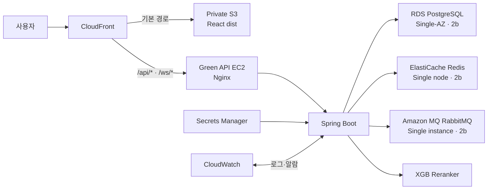

이 구조는 현재 통합 서버를 `Blue`, 새 API 전용 EC2를 `Green`으로 두고 병렬로 구축한 뒤 CloudFront 트래픽을 전환한다. Blue의 Compose는 Green 검증과 롤백 대기 기간이 끝날 때까지 변경하거나 중지하지 않는다. Git 저장소와 로컬 개발용 `compose.yaml`은 유지하고 운영 배포만 나눈다.

## 목표 구조



운영 서버의 최종 Compose에는 다음만 남깁니다.

```text
compose.api.prod.yaml
├── nginx
├── api
└── xgb-reranker
```

PostgreSQL, Redis, RabbitMQ, Web은 Compose에서 제거합니다. 로컬 개발용 [compose.yaml](/Users/juhoseok/Desktop/prototype/compose.yaml)은 그대로 유지합니다.

## Blue/Green 전환 원칙

| 구분 | 전환 중 역할 | 전환 후 처리 |
| --- | --- | --- |
| Blue | 기존 `buildgraph-demo-ec2`에서 Web·API·PostgreSQL·Redis·RabbitMQ·XGB를 계속 서비스 | 롤백 대기 기간이 끝난 후 중지·종료 |
| Green | 새 EC2에서 Nginx·API·XGB와 관리형 데이터 서비스를 먼저 검증 | 최종 API 운영 서버로 유지 |

전환 중에는 Blue와 Green이 서로 다른 EC2와 네트워크 인터페이스를 사용한다. 따라서 포트 번호를 다르게 만들 필요가 없다.

| 연결 | Blue | Green | 원칙 |
| --- | ---: | ---: | --- |
| CloudFront → Nginx | 80 | 80 | 서로 다른 EC2이므로 충돌 없음 |
| Nginx → Spring Boot 컨테이너 | 8080 | 8080 | 호스트에 8080을 공개하지 않음 |
| API → PostgreSQL | 5432 | 5432 | Green은 RDS endpoint 사용 |
| API → Redis | 6379 | 6379 | Green은 TLS가 활성화된 ElastiCache 사용 |
| API → RabbitMQ | 5672 | 5671 | Green은 Amazon MQ AMQPS만 사용 |

같은 EC2에서 Blue와 Green 컨테이너를 동시에 실행할 때만 호스트 포트 충돌을 피하려고 `18080` 같은 별도 포트가 필요하다. 이 계획은 새 Green EC2를 사용하므로 별도 포트를 만들지 않는다.

## 저비용 가용성 결정

현재 단계에서는 고가용성보다 월 고정비 절감을 우선한다.

| 서비스 | 확정 구성 | 배치 |
| --- | --- | --- |
| RDS PostgreSQL | Single-AZ DB instance | `ap-northeast-2b` 우선 |
| ElastiCache Redis | Replica 없는 single node | `ap-northeast-2b` 우선 |
| Amazon MQ RabbitMQ | Single-instance broker | `ap-northeast-2b` Private Subnet |
| Private Subnet | 2개 | `2a: 10.0.32.0/24`, `2b: 10.0.33.0/24` |
| NAT Gateway | 생성하지 않음 | Private Data Subnet은 VPC local route만 사용 |

두 Private Subnet은 RDS DB Subnet Group과 ElastiCache Subnet Group이 공용으로 사용한다. Amazon MQ Single-instance broker는 `2b` Private Subnet 하나를 선택한다. `2a` Private Subnet에는 현재 상시 노드를 배치하지 않고 RDS Subnet Group 요구사항과 향후 확장에 사용한다.

이 구성은 `2b` AZ 장애나 관리형 서비스 점검 중 자동 장애조치를 제공하지 않는다. API EC2와 데이터 서비스가 함께 중단될 수 있는 위험을 수용하는 저비용 구성이다.

## 데이터 보존 정책

- 기존 PostgreSQL 사용자 데이터는 보존하지 않고 새 RDS를 Flyway와 seed로 초기화한다.
- 기존 Redis key와 RabbitMQ 메시지는 보존하지 않는다.
- `recommendation-models`의 기존 XGB 모델과 `agent-log-data`의 PC Agent 로그도 보존하지 않는다.
- API Key, OAuth Secret, JWT Secret 등 `.env.prod`의 비밀값도 반드시 보존하고 Secrets Manager로 옮긴다.
- 분리 후 XGB reranker를 활성화하려면 기존 모델 복원이 아니라 새 모델 artifact 배포 또는 재학습 절차를 별도로 마련한다.

## Phase 0. 구현 전 확정 및 현황 기록

실제 실행 순서와 현재 기준선은 [aws-infrastructure-phase-0-runbook.md](/Users/juhoseok/Desktop/prototype/docs/aws-infrastructure-phase-0-runbook.md)에 기록합니다. AWS Management Console 조작과 운영 EC2 명령 실행은 사용자가 수행하고, 저장소 분석·로컬 검증·결과 문서화는 Codex가 지원합니다.

먼저 아래 내용을 기록합니다.

- 현재 CloudFront Distribution ID와 Origin 설정
- Flyway로 새 DB의 스키마와 seed를 재생성할 수 있는지 확인
- RabbitMQ exchange, queue, routing key가 코드에서 자동 선언되는지 확인
- EC2의 Docker Volume과 환경 변수
- 현재 배포 버전과 Git SHA
- `.env.prod`의 비밀값이 유실되지 않도록 현재 파일을 유지하고 Secrets Manager 이전 대상을 확정
- 현재 [compose.prod.yaml](/Users/juhoseok/Desktop/prototype/compose.prod.yaml) 렌더링 결과

이 단계에서는 기존 서비스를 변경하지 않습니다.

### 산출물:

- 현재 설정 목록
- 롤백 기준 버전
- Secrets Manager 이전 대상 목록
- 전환 시간 및 담당자

## Phase 1. 테스트를 먼저 작성

프로젝트 규칙에 따라 설정을 수정하기 전에 검증 코드를 먼저 준비합니다.

테스트 코드, 실행 명령, 현재 실패 기준선은 [aws-infrastructure-phase-1-tests.md](/Users/juhoseok/Desktop/prototype/docs/aws-infrastructure-phase-1-tests.md)에 기록합니다.

### 정적 검증

- `compose.api.prod.yaml`에 `web`, `postgres`, `redis`, `rabbitmq`가 없는지 검사
- 운영 환경에서 DB·Redis·RabbitMQ 포트를 외부에 공개하지 않는지 검사
- Nginx 설정의 `nginx -t`
- Spring Boot가 관리형 endpoint 환경 변수를 읽는지 검사
- RabbitMQ TLS `5671` 설정 검사
- Redis TLS 및 인증 설정 검사
- CloudFront `/api/*` 캐시 비활성 설정 검사

### 통합 테스트

- RDS 연결 및 Flyway 실행
- `SELECT extversion FROM pg_extension WHERE extname='vector'`
- ElastiCache 읽기·쓰기·TTL
- OAuth one-time code 저장 및 1회 소비
- WebSocket ticket 발급 및 소비
- Amazon MQ publish/consume
- RabbitMQ 연결 종료 후 재연결
- XGB reranker의 RDS 연결

### 배포 후 스모크 테스트

- `/api/health`
- 로그인·토큰 갱신·로그아웃
- Google OAuth callback
- 부품 목록과 견적 저장
- Build Chat Redis cache
- Agent RabbitMQ job
- `/ws/*` WebSocket 연결
- RAG vector 검색
- XGB reranker 요청
- PC Agent 로그 업로드

## Phase 2. 네트워크와 보안 구성

현재 VPC에는 퍼블릭 서브넷만 있으므로 관리형 서비스를 위한 Private Data Subnet을 추가합니다.

### 확정 구성:

```text
10.0.32.0/24 → ap-northeast-2a
10.0.33.0/24 → ap-northeast-2b
```

- 기존 Public Subnet 2개와 새 Private Subnet 2개를 합쳐 총 4개 Subnet을 사용
- 세 번째 `ap-northeast-2c` Subnet은 생성하지 않음
- Private Route Table에는 `10.0.0.0/16 → local`만 유지
- Internet Gateway와 NAT Gateway로 향하는 `0.0.0.0/0` route를 추가하지 않음
- API EC2는 같은 VPC의 `local` route를 통해 Private endpoint에 접근

### 보안 그룹:

| 보안 그룹 | 인바운드 |
| --- | --- |
| 공유 API EC2 SG | 기존 `buildgraph-demo-ec2-sg` / `sg-099aac782b77a854e`를 Blue와 Green에 함께 연결 |
| RDS SG | 공유 API EC2 SG에서 5432만 허용 |
| Redis SG | 공유 API EC2 SG에서 6379만 허용 |
| RabbitMQ SG | 공유 API EC2 SG에서 5671만 허용 |

빠른 병렬 전환을 위해 Green 전용 SG는 새로 만들지 않는다. 공유 SG를 사용하는 동안 Blue와 Green 모두 관리형 데이터 서비스에 네트워크상 접근할 수 있다. Blue는 기존 Compose의 데이터 서비스를 계속 사용하고 `.env.prod`를 변경하지 않으며, 실제 RDS·Redis·RabbitMQ 연결 검증은 Green에서만 수행한다.

### 추가 작업:

- AWS 인프라 리소스는 Terraform이 아닌 AWS Management Console에서 수동 생성
- 콘솔에서 생성한 리소스 이름, ID, ARN, endpoint, 보안 그룹 규칙을 문서에 기록
- Phase 2에서 Blue EC2의 Instance Role을 추가하고 Systems Manager Session Manager 접속을 먼저 검증
- Green EC2도 기존 공유 SG를 연결하므로 Blue의 SSH 22 규칙을 일시적으로 상속한다. Green 접속은 SSM을 우선 사용하고, Blue의 SSH 배포 종료 후 공유 SG의 22 규칙을 제거한다.
- 현재 GitHub Actions가 Blue에 SSH 배포를 사용하므로 Blue의 SSH `0.0.0.0/0` 제거는 Phase 9의 최종 전환과 롤백 대기 뒤 수행
- Secrets Manager 읽기 권한은 Secret ARN을 만든 뒤 최소 권한으로 추가
- CloudWatch Agent는 API 전용 Compose 전환 전에 설치
- 새 Elastic IP는 Phase 6에서 Green EC2에 연결하며 Blue의 기존 Public IP와 CloudFront Origin은 변경하지 않음
- PostgreSQL, Redis, RabbitMQ는 Public access 비활성화
- Phase 2 콘솔 절차는 [aws-infrastructure-phase-2-console-guide.md](/Users/juhoseok/Desktop/prototype/docs/aws-infrastructure-phase-2-console-guide.md)를 순서대로 수행

## Phase 3. Green용 RDS 생성

Green 환경에서 사용할 데이터베이스를 먼저 생성한다. 이 단계에서는 Blue의 datasource, Web, Redis, RabbitMQ와 실행 중인 컨테이너를 변경하지 않는다.

AWS Management Console의 실제 생성 순서는 [aws-infrastructure-phase-3-console-guide.md](/Users/juhoseok/Desktop/prototype/docs/aws-infrastructure-phase-3-console-guide.md)를 따른다.

### RDS 생성

- RDS PostgreSQL 16
- Single-AZ DB instance
- 배치 AZ는 API EC2와 같은 `ap-northeast-2b` 우선
- Private DB Subnet Group
- Public access 비활성
- 자동 백업 및 삭제 보호
- 스토리지 자동 확장
- `vector` 확장 활성화
- 빠른 첫 배포는 현재 datasource 계약에 맞춰 migration과 runtime이 같은 사용자를 사용
- migration/runtime 사용자 분리는 Green 배포 후 별도 datasource 설정과 함께 하드닝
- 빠른 첫 배포에서는 비밀번호를 Self managed로 보관하고 Green 배포 후 Secrets Manager로 이전

### Green 초기화 준비

- RDS endpoint만 기록하고 실제 비밀번호는 문서에 남기지 않음
- Green EC2가 생성되기 전에는 RDS를 Public으로 열지 않고, Blue의 datasource와 `.env.prod`는 기존 PostgreSQL 컨테이너를 계속 가리킴
- Flyway, extension, seed, embedding backfill은 Phase 6의 Green 배포에서 실행

### 생성 완료 기준

기존 PostgreSQL 데이터는 이전하지 않는다. AWS DMS, `pg_dump`, `pg_restore`, row count 비교, DB 쓰기 중단은 수행하지 않는다.

- RDS가 Private Subnet과 RDS SG를 사용
- RDS SG의 Source가 공유 API EC2 SG `sg-099aac782b77a854e`
- Blue PostgreSQL 컨테이너는 계속 실행

## Phase 4. Green용 ElastiCache Redis 생성

Green은 기존 Redis 데이터를 옮기지 않고 빈 ElastiCache를 사용한다. Blue의 로그인 임시 코드, WebSocket ticket, 캐시는 CloudFront 전환 전까지 기존 Redis에 그대로 남는다.

AWS Management Console의 실제 생성 순서는 [aws-infrastructure-phase-4-console-guide.md](/Users/juhoseok/Desktop/prototype/docs/aws-infrastructure-phase-4-console-guide.md)를 따른다.

### 저비용 구성:

- Redis OSS 7.1 node-based cache
- `cache.t4g.small` single node
- Cluster mode disabled
- Replica 없음
- Multi-AZ와 자동 장애조치 비활성
- 배치 AZ는 API EC2와 같은 `ap-northeast-2b` 우선
- Private Subnet
- TLS Required
- Redis OSS AUTH default user와 self-managed AUTH token 사용
- 자동 백업 비활성
- 공유 API EC2 SG에서만 접근

### 생성 순서:

- ElastiCache를 Private Subnet과 Redis SG로 생성
- endpoint만 문서에 기록하고 AUTH token은 개인 비밀번호 관리자에 보관
- AUTH token의 Secrets Manager 이전은 Phase 6에서 수행
- Redis SG의 Source가 공유 API EC2 SG `sg-099aac782b77a854e`인지 확인
- Green 연결·TTL·OAuth code·WebSocket ticket 테스트는 Phase 6에서 수행
- Blue Redis 컨테이너는 계속 실행

Redis 데이터 이전이나 key·TTL 비교는 수행하지 않는다.

## Phase 5. Green용 Amazon MQ RabbitMQ 생성

Amazon MQ는 저비용 RabbitMQ Single-instance broker를 사용합니다.

AWS Management Console의 실제 생성 순서는 [aws-infrastructure-phase-5-console-guide.md](/Users/juhoseok/Desktop/prototype/docs/aws-infrastructure-phase-5-console-guide.md)를 따른다.

### 저비용 구성:

- RabbitMQ `3.13`
- Single-instance RabbitMQ broker
- 신규 생성 가능한 최소 instance type인 `mq.m7g.medium`
- `ap-northeast-2b`의 `10.0.33.0/24` Private Subnet 사용
- Private access
- AMQPS `5671`
- CloudWatch general logs
- 공유 API EC2 SG만 접근
- 초기 인증정보는 개인 비밀번호 관리자에 보관하고 Phase 6에서 Secrets Manager로 이전

`mq.t3.micro`는 신규 broker 생성이 중단된 deprecated type이므로 선택하지 않는다. RabbitMQ 4.2는 AWS의 최신 권장 버전이지만 기본 queue type이 quorum으로 바뀌는 호환성 변화가 있다. 현재 BuildGraph queue 선언과 smoke test를 먼저 그대로 검증하기 위해 Green 첫 배포는 지원 중인 3.13으로 고정하고, 4.2 업그레이드는 queue type을 명시한 뒤 별도 수행한다.

### 생성 순서:

- Amazon MQ를 빈 Broker로 시작
- AMQPS endpoint만 기록하고 실제 password는 문서에 남기지 않음
- RabbitMQ SG의 Source가 공유 API EC2 SG `sg-099aac782b77a854e`인지 확인
- API의 exchange, queue, binding 자동 선언과 publish/consume은 Phase 6에서 검증
- broker-level·queue-level `MessageCount` 경보는 Phase 6에서 실제 queue가 생성되고 정상 적체 기준을 확인한 뒤 생성
- Blue Worker와 RabbitMQ 컨테이너는 계속 실행

기존 RabbitMQ 메시지는 이전하지 않으므로 Queue drain이나 메시지 발행 중단 대기는 수행하지 않는다.

Single-instance broker는 자동 failover 대상이 없고 유지보수나 장애 때 중단될 수 있으므로 Spring Client의 재연결을 반드시 검증합니다.

## Phase 6. Green API EC2와 API 전용 Compose 구축

새 Green EC2를 기존 Blue와 같은 Public Subnet `ap-northeast-2b`에 병렬 생성한다. 인스턴스 타입은 현재 Blue와 같은 `t3.medium`으로 확정하며, Blue를 축소하거나 중지해서 용량을 확보하지 않는다.

AWS Management Console과 Green 서버에서 사용자가 수행할 실제 순서는 [aws-infrastructure-phase-6-console-guide.md](/Users/juhoseok/Desktop/prototype/docs/aws-infrastructure-phase-6-console-guide.md)를 따른다.

Green EC2 생성 원칙:

- 이름: `buildgraph-demo-api-green-ec2`
- 기존 `buildgraph-demo-ec2-sg` / `sg-099aac782b77a854e`를 Blue와 공유
- Green 전용 IAM Role에 SSM, ECR pull, 지정된 Secret ARN 읽기 권한만 부여
- 공유 SG에서 상속한 SSH 22 규칙은 사용하지 않고, Green용 SSH Key 기반 배포를 새로 구성하지 않음
- 새 Elastic IP를 Green에 연결하고 Blue Public IP는 변경하지 않음
- SSM Session Manager 접속과 SSM Run Command를 먼저 검증

저장소에는 기존 [compose.prod.yaml](/Users/juhoseok/Desktop/prototype/compose.prod.yaml)을 직접 없애지 않고 새 파일을 먼저 추가한다.

```text
compose.api.prod.yaml
├── nginx
├── api
└── xgb-reranker
```

### 주요 변경:

- `postgres`, `redis`, `rabbitmq`, `mailpit`, `web` 제거
- 인프라 서비스에 대한 `depends_on` 제거
- Phase 6 최초 bootstrap은 검증·push된 Git SHA를 Green EC2에서 source build
- Phase 8 CI/CD가 준비되면 ECR의 Git SHA 태그 이미지 pull 방식으로 교체하고 `latest`는 사용하지 않음
- API와 XGB 모두 RDS endpoint 사용
- Nginx는 정적 파일 제공 기능을 제거하고 API/WS 프록시만 담당
- Phase 6 source build와 Phase 8 ECR 이미지 모두 동일하게 검증된 Git SHA를 배포 기준으로 기록
- Secrets Manager 값을 배포 시점에 주입
- Blue의 기존 PostgreSQL, Redis, RabbitMQ, `recommendation-models`, `agent-log-data` Volume은 Phase 9의 전체 전환과 롤백 대기 후 삭제 가능
- 새 XGB 모델이 준비되지 않았다면 `RECOMMENDATION_RERANKER_ENABLED=false`를 유지

Green 구축 중에는 Blue Volume에 손대지 않는다. Phase 9 안정화와 롤백 대기가 끝난 후에만 Blue에서 `docker compose down -v` 또는 개별 Volume 삭제 여부를 결정한다.

Phase 6의 host source build는 아직 Phase 8 ECR·OIDC·SSM 배포 파이프라인이 없을 때 Green을 검증하기 위한 bootstrap 방식이다. 사용자 트래픽 전환 전에는 Phase 8에서 ECR `:<git-sha>` 이미지 배포로 교체한다.

API Nginx 설정은 현재 [default.conf](/Users/juhoseok/Desktop/prototype/infra/nginx/default.conf)에서 정적 Web 제공 부분과 API 프록시 부분을 분리해야 합니다.

Green 배포 검증 순서:

1. `compose.api.prod.yaml`을 Green에만 배포
2. 빈 RDS에 Flyway migration과 seed 적용
3. `vector`, `pgcrypto`, Flyway history와 RAG vector 검색 확인
4. ElastiCache TLS·인증·TTL·OAuth code·WebSocket ticket 확인
5. Amazon MQ AMQPS publish/consume과 재연결 확인
6. Nginx `80` → API 컨테이너 `8080`과 `/ws/*` upgrade 확인
7. `/api/health`와 전체 E2E 확인
8. 모든 검증 동안 Blue Compose와 기존 CloudFront Origin 유지

## Phase 7. S3와 CloudFront Staging으로 사전 검증

콘솔 실행 절차: [aws-infrastructure-phase7-console-guide.md](aws-infrastructure-phase7-console-guide.md)

### S3

- React 빌드 결과 `apps/web/dist` 업로드
- S3 Public access 전체 차단
- CloudFront OAC만 읽기 허용
- 해시 정적 자산은 장기 캐시
- `index.html`은 `no-cache`

### CloudFront

| 경로 | Origin | 정책 |
| --- | --- | --- |
| `*` | S3 | 정적 캐시 |
| `/api/*` | API EC2 Nginx | 캐시 비활성 |
| `/ws/*` | API EC2 Nginx | WebSocket 전달 |

CloudFront는 중간에 ALB를 두지 않고 Elastic IP가 연결된 Green API EC2의 Public DNS를 Origin으로 사용해 Nginx `80`에 직접 연결한다. 먼저 기존 Distribution을 복제한 Staging Distribution에서 Green을 검증하고 Primary Distribution은 아직 Blue를 유지한다.

Staging 검증 원칙:

1. 기존 Distribution에서 HTTP/3가 활성화되어 있으면 Continuous Deployment를 바로 만들지 않고 중단한다. CloudFront Continuous Deployment는 HTTP/3 Distribution을 지원하지 않는다.
2. Private S3의 Bucket Policy에 Staging Distribution의 OAC 읽기 권한도 반영한다.
3. 제어 가능한 API 요청은 `aws-cf-cd-` 접두사가 붙은 header 기반 정책으로 Staging에 전달한다.
4. 브라우저 WebSocket 포함 E2E는 낮은 비율의 weight-based 정책과 session stickiness로 검증한다.
5. Staging 비율은 처음부터 크게 올리지 않고 CloudWatch 오류율을 확인하며 조정한다.
6. 검증이 실패하면 Staging 트래픽을 0으로 되돌리고 Primary와 Blue는 그대로 유지한다.

`/api/*`에는 다음이 전달되어야 합니다.

- 모든 HTTP method
- Authorization
- Origin
- Cookies
- Query string

SPA fallback은 전체 Distribution의 404를 `index.html`로 바꾸면 API 404까지 가려질 수 있습니다. 따라서 기본 S3 동작에만 CloudFront Function 등을 적용하여 확장자 없는 Web route를 `index.html`로 처리하는 편이 안전합니다.

참고:

- [CloudFront Continuous Deployment 동작](https://docs.aws.amazon.com/AmazonCloudFront/latest/DeveloperGuide/understanding-continuous-deployment.html)
- [CloudFront Continuous Deployment 제한 사항](https://docs.aws.amazon.com/AmazonCloudFront/latest/DeveloperGuide/continuous-deployment-quotas-considerations.html)

## Phase 8. Green 대상 CI/CD 분리

현재 [deploy-compose.yml](/Users/juhoseok/Desktop/prototype/.github/workflows/deploy-compose.yml)은 Web과 API를 동시에 빌드해 EC2에 전체 저장소를 복사합니다. 이를 세 파이프라인으로 나눕니다.

### Web 배포

```text
apps/web 변경
→ npm test
→ npm run build
→ S3 sync
→ index.html CloudFront invalidation
```

### API 배포

```text
apps/api 또는 API Nginx 변경
→ Gradle test
→ bootJar
→ Docker image build
→ ECR push :git-sha
→ EC2에서 compose pull/up
→ /api/health 확인
→ 실패 시 이전 SHA로 롤백
```

### XGB 배포

```text
XGB 코드 변경
→ 테스트
→ 이미지 빌드
→ ECR push
→ xgb-reranker만 재배포
```

장기적으로는 SSH key를 GitHub Secrets에 저장하는 현재 방식 대신 다음을 사용합니다.

```text
GitHub OIDC
→ AWS IAM Role
→ ECR/S3/CloudFront
→ SSM SendCommand로 EC2 배포
```

Green API 배포는 처음부터 위 OIDC·SSM 방식만 사용한다. Blue용 기존 SSH 워크플로우는 롤백 대기 기간까지 유지하되 Green을 대상으로 실행하지 않는다.

## Phase 9. 최종 전환 및 검증

Green 검증이 모두 끝난 뒤 다음 순서로 전환한다.

1. Blue Compose와 기존 CloudFront Origin이 정상인지 마지막으로 확인
2. CloudFront Staging에서 S3 Web과 Green `/api/*`, `/ws/*` 전체 E2E 확인
3. Primary CloudFront의 `/api/*`, `/ws/*` Origin을 Green으로 변경
4. Primary CloudFront의 기본 Origin을 S3로 변경
5. Distribution 상태가 `Deployed`가 될 때까지 Blue를 계속 실행
6. 실제 CloudFront 도메인에서 전체 E2E와 CloudWatch 지표 확인
7. 정해진 롤백 대기 기간 동안 Blue EC2와 기존 Compose를 그대로 유지
8. 실패하면 Primary Origin을 Blue로 되돌림
9. 안정화되면 Blue용 GitHub Actions SSH 배포를 비활성화
10. Blue Compose를 중지하고 Blue EC2를 먼저 `Stop`하여 관찰
11. 추가 롤백이 필요 없음을 확인한 후 Blue EC2·EBS·기존 Volume을 삭제

### 완료 기준:

- CloudFront 도메인에서 Web route 새로고침 성공
- `/api/*` 응답이 캐시되지 않음
- `/ws/*` 연결과 인증 성공
- RDS·Redis·RabbitMQ가 외부에 공개되지 않음
- 운영 Compose에 `nginx`, `api`, `xgb-reranker`만 존재
- Web/API를 독립적으로 배포할 수 있음
- Green EC2의 API 컨테이너 8080이 호스트나 보안 그룹에 공개되지 않음
- RDS·Redis·RabbitMQ SG의 Source가 공유 API EC2 SG `sg-099aac782b77a854e`
- 비LLM API p95 500ms 목표 충족
- API 재배포 중 RDS·Redis·RabbitMQ가 중단되지 않음
- 이전 버전 롤백 성공

## 롤백 계획

- 전환 전 Green 문제: CloudFront를 변경하지 않고 Green만 수정
- 전환 후 Web/API 문제: Primary CloudFront의 기본 동작과 `/api/*`, `/ws/*` Origin을 Blue로 복구
- Green 코드 문제: Green에서 ECR 이전 SHA 이미지로 재배포
- 관리형 서비스 문제: Blue Origin으로 되돌려 Blue의 기존 PostgreSQL·Redis·RabbitMQ를 다시 사용

PostgreSQL·Redis·RabbitMQ·XGB 모델·PC Agent 로그의 기존 데이터는 롤백 대상이 아니다. Green 전환 후 생성된 쓰기 데이터는 Blue로 역동기화하지 않으므로 Blue 롤백 시 사라질 수 있다. 롤백은 서비스 연결과 코드 배포 버전에 대해서만 보장한다.

## 예상 일정

| 단계 | 예상 |
| --- | --- |
| 기준선·테스트 작성 | 1일 |
| 네트워크·관리형 서비스 구성 | 1~2일 |
| RDS 초기화 및 검증 | 1일 |
| Redis·RabbitMQ 전환 | 1일 |
| API Compose·CI/CD 분리 | 1~2일 |
| S3·CloudFront 전환 | 1일 |
| E2E·부하·롤백 검증 | 1일 |
| 총 예상 | 7~9일 |

현재 [aws-deployment-strategy.md](/Users/juhoseok/Desktop/prototype/docs/aws-deployment-strategy.md)는 ECS Fargate를 전제로 작성된 이전 대안이다. 현재 배포 작업은 이 문서의 API EC2 + RDS Single-AZ + ElastiCache single node + Amazon MQ single instance + AWS 콘솔 수동 생성 결정을 우선한다.

## 확정 사항

1. CloudFront에서 중간 ALB 없이 API EC2 Nginx로 직접 연결
2. 기존 PostgreSQL·Redis·RabbitMQ 데이터는 폐기하고 새 관리형 서비스에서 초기화
3. AWS 인프라는 Terraform이 아닌 AWS Management Console에서 수동 생성
4. PostgreSQL·Redis·RabbitMQ·XGB 모델·PC Agent 로그의 기존 데이터는 모두 폐기 가능
5. `.env.prod`의 비밀값은 유지하고 Secrets Manager로 이전
6. 저비용 구성을 위해 Private Subnet은 `2a`, `2b` 두 개만 만들고 NAT Gateway는 생성하지 않음
7. RDS, ElastiCache, Amazon MQ는 모두 `2b` 우선 단일 인스턴스로 시작하며 자동 failover 부재를 수용
8. 기존 통합 EC2는 Blue로 유지하고 새 API 전용 EC2를 Green으로 병렬 생성
9. Blue와 Green은 서로 다른 EC2이므로 Nginx `80`, API 컨테이너 `8080`을 동일하게 사용
10. Green은 기존 `buildgraph-demo-ec2-sg`를 Blue와 공유하며, 관리형 데이터 서비스 SG의 Source도 이 공유 SG를 사용
11. CloudFront 전환과 롤백 대기 기간이 끝나기 전에는 Blue Compose와 EC2를 중지하지 않음
